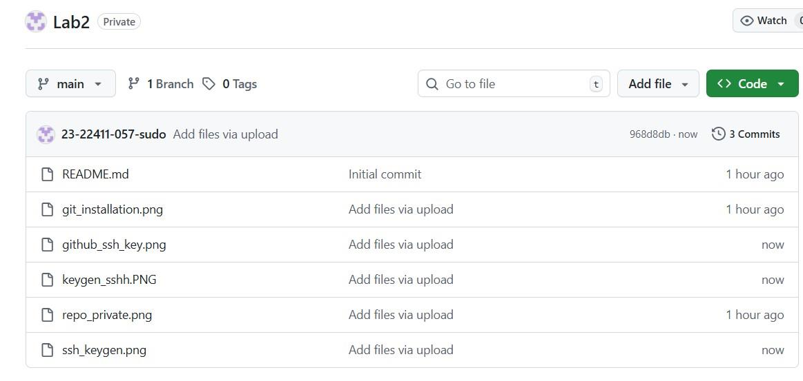

# Cloud Computing Lab 02 - Git Installation and Version Control

**Name:** Saira Ejaz  
**Roll No:** 2023-BSE-057  
**Section:** 5-B  
**Subject:** Cloud Computing Lab  
**Lab No:** 2  

---
## 📘 Tasks Overview

### Task 1: Git Installation

### Task 2: Create Private GitHub Repository

### Task 3: Connect Repository via SSH

### Task 4: Configure Git Username and Email

### Task 5: Explore the .git Folder

### Task 6: Local Repository Management

### Task 7: File Status & Staging

### Task 8: Branch Creation Using GitHub GUI

### Task 9: Branch Creation and Push Using Git Bash

### Task 10: Branching & Merging

### Task 11: Pull Request and Branch Review

### Task 12: Detailed Branch Strategy (Develop/Staging)

### Bonus Task: Simulated Team Collaboration

### Task 13: Code Review Workflow

### Task 14: Branch Cleanup Best Practices

### Exam Evaluation Section
#### Q1 — Advanced Branching & Merge Verification

#### Q2 — Multi-Stage Workflow Simulation

#### Q3 — Collaboration & Conflict Resolution

---
### 📎 Files Included
- `README.md`
- `Saira Ejaz CC Lab 02.pdf`
- `screenshots/` (all images in correct order)

